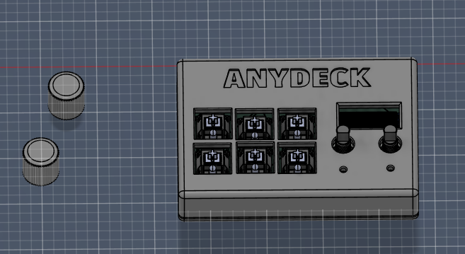
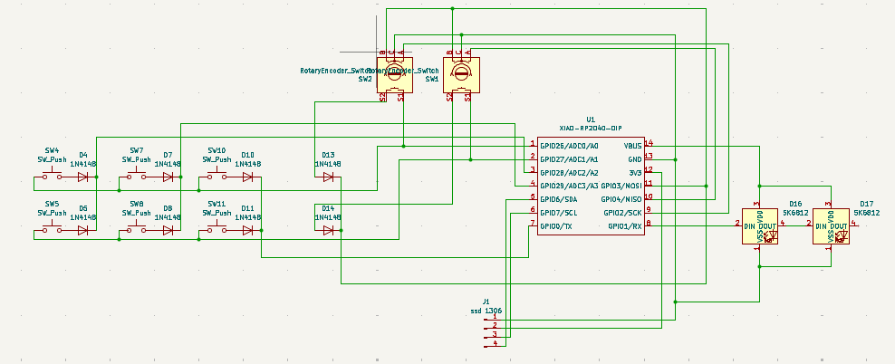
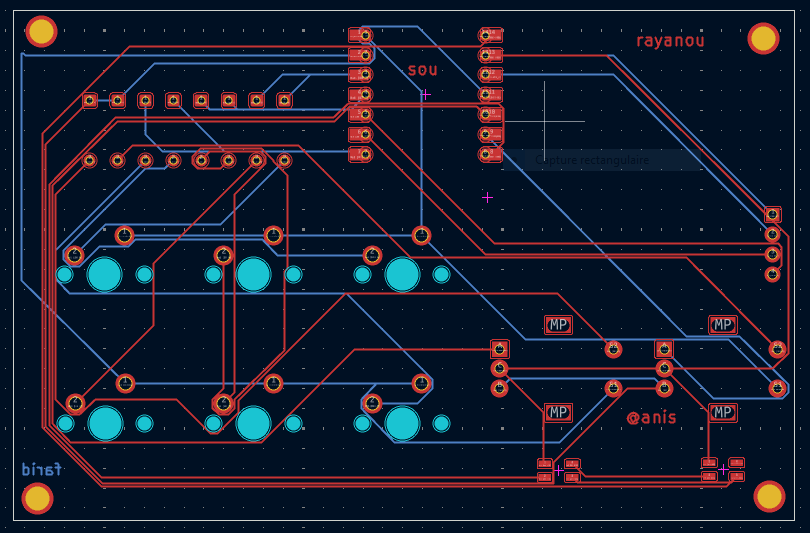
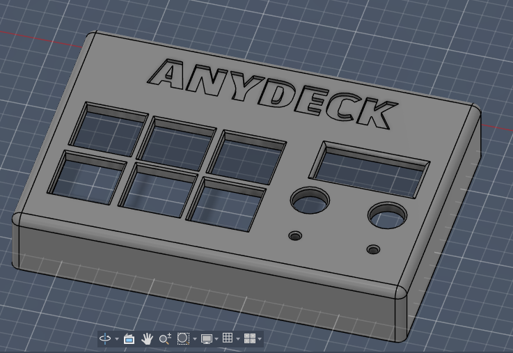

# ANYDECK Macropad

Welcome to the **ANYDECK** project! This is an open-source, customizable 6-key macropad equipped with two rotary encoders, an OLED display, and RGB lighting. Powered by the Seeed Studio XIAO RP2040, it's designed to help you boost your productivity and streamline your workflow.

---

## 📸 Overall Hackpad
Here is a look at the fully assembled ANYDECK with its custom 3D-printed case, mechanical switches, and rotary encoder knobs.

---

## 🔌 Schematic
The circuit is built around the Seeed Studio XIAO RP2040 microcontroller. It features a switch matrix with diodes for anti-ghosting, I2C connections for the SSD1306 OLED display, and data lines for the SK6812 RGB LEDs.

---

## 🛠️ Printed Circuit Board (PCB)
The custom 2-layer PCB was designed to neatly route all components within the compact footprint of the ANYDECK case. 

*Design credits on silkscreen: rayanou, sou, farid, @anis.*

---

## 📦 Case Design and Assembly
The enclosure consists of a 3D-printed top housing and a bottom plate. The top housing includes precision cutouts for the 6 mechanical switches, the OLED screen, and the two rotary encoders. 

**Case Top View:**

**Internal Assembly / Fit:**
The switches snap securely into the top plate, while the rotary encoders and screen sit flush with the surface.

---

## 🧾 Bill of Materials (BOM)

To build your own ANYDECK, you will need the following components:

| Item | Quantity | Description / Reference |
| :--- | :---: | :--- |
| **Microcontroller** | 1 | Seeed Studio XIAO RP2040 |
| **Mechanical Switches** | 6 | MX-compatible mechanical switches (e.g., Cherry, Gateron) |
| **Diodes** | 8 | 1N4148 (Through-hole or SMD, per your PCB footprint) |
| **Rotary Encoders** | 2 | Standard Rotary Encoders with push-button functionality (SW1, SW2) |
| **Encoder Knobs** | 2 | Sized to fit your rotary encoders |
| **Display** | 1 | SSD1306 OLED Display (I2C) |
| **RGB LEDs** | 2 | SK6812 (D16, D17) |
| **3D Printed Case** | 1 | ANYDECK Top Housing (`YYM.PNG`) |
| **3D Printed Base** | 1 | Bottom Plate |
| **Screws/Hardware** | Set | M2/M3 screws for case assembly (as per your CAD holes) |

---

## 🚀 Getting Started

1. **PCB Fabrication:** Order the PCB using the provided Gerber files.
2. **3D Printing:** Print the top and bottom cases (PLA, PETG, or Resin work great).
3. **Soldering:** Solder the diodes, XIAO RP2040, OLED, and encoders to the PCB.
4. **Assembly:** Fit the mechanical switches into the 3D-printed top plate, then solder them to the PCB. Secure the case with screws.
5. **Firmware:** Flash your favorite macropad firmware (such as KMK or QMK) configured for the RP2040.