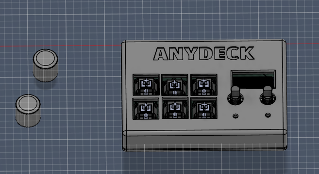
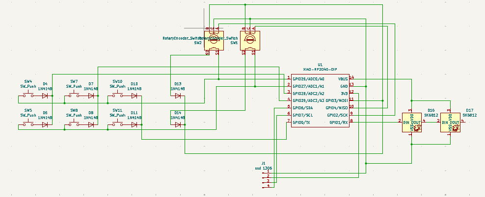
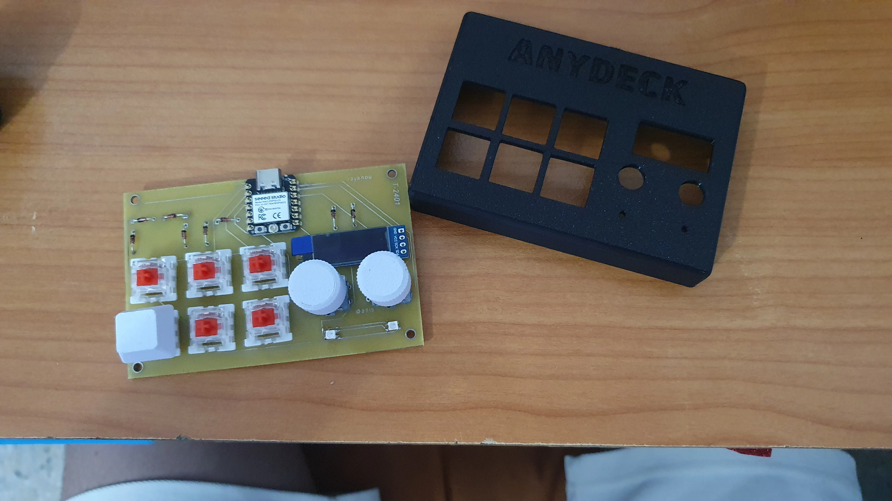

# ANYDECK Macropad

ANYDECK is a 6-key mechanical macropad I designed to be simple and useful. It uses a XIAO RP2040 controller and features two rotary encoders, a small OLED screen, and RGB lighting.

The goal was to make a sturdy desktop tool that is easy to build for managing shortcuts or volume.

---

## Project Overview
This is a photo of the finished macropad inside its 3D printed case.

---

## Schematic
The build uses a XIAO RP2040. The keys are wired with diodes to prevent signal conflicts. 

---

## PCB
The printed circuit board is a compact double-layer design that holds all parts,

---

## Case and Assembly
The case is designed in two parts. The switches click into the top plate before being soldered to the PCB to keep everything solid.

**Top case view:**

**Internal assembly:**

---

## Bill of Materials (BOM)

* 1x Seeed Studio XIAO RP2040
* 6x Mechanical switches (MX compatible)
* 2x EC11 rotary encoders
* 1x SSD1306 OLED screen (I2C)
* 8x 1N4148 Diodes
* 2x SK6812 RGB LEDs
* 1x 3D printed case (Top and Base)

---

## Build Instructions

1. Solder the diodes to the PCB. Make sure the black line on the diode matches the mark on the board.
2. Solder the XIAO RP2040 and the two RGB LEDs.
3. Install and solder the OLED screen and the two rotary encoders.
4. Put the switches into the top case, place the PCB over them, and solder the switch pins.
5. Close the case with the bottom plate and add your keycaps and encoder knobs.

---

## How to Use

Once you plug it in via USB-C, your computer will see ANYDECK as a keyboard. You can change shortcuts by opening the code.py file on the USB drive (using CircuitPython/KMK). The encoders control volume and scrolling by default, and the screen shows your current navigation info.

