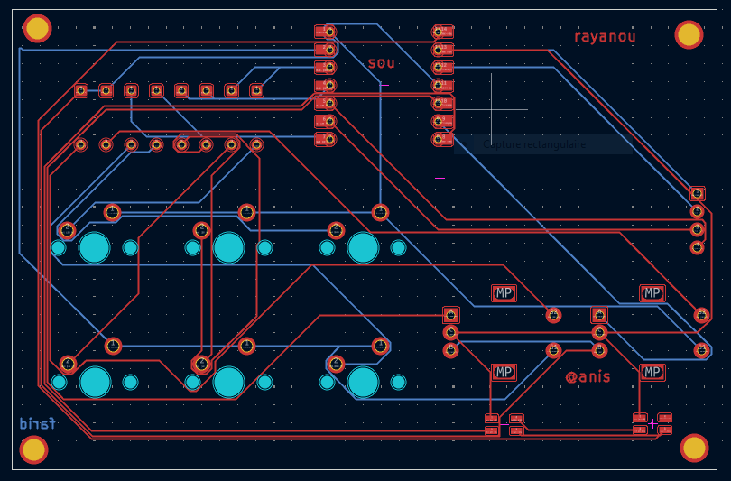
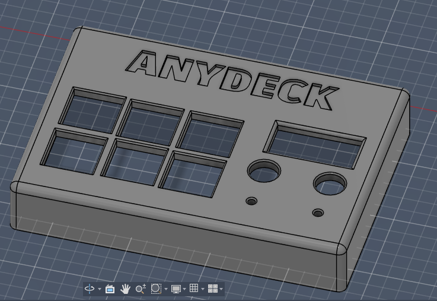
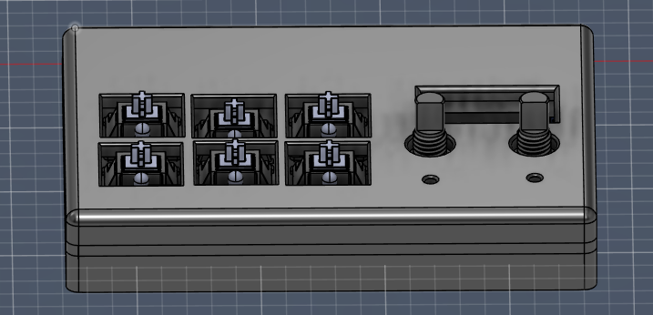

# ANYDECK Macropad

**ANYDECK** est un macropad mécanique à 6 touches, puissant et entièrement personnalisable. Conçu autour du microcontrôleur **XIAO RP2040**, il intègre deux encodeurs rotatifs, un écran OLED et un éclairage RGB pour offrir un contrôle total sur votre workflow.

---

## 📸 Aperçu Global
Voici le rendu final de l'ANYDECK assemblé, montrant l'intégration des touches, de l'écran et des encodeurs dans son boîtier 3D.

---

## 🔌 Schématique
Le circuit gère une matrice de 6 touches avec diodes anti-ghosting, une communication I2C pour l'écran OLED et un bus de données pour les LEDs Neopixel.

---

## 🛠️ Design du PCB
Le PCB double couche a été conçu pour maximiser l'espace tout en assurant une connexion fiable pour tous les composants.

---

## 📦 Boîtier et Assemblage
L'enclosure est optimisée pour l'impression 3D, avec un ajustement précis pour les composants mécaniques et électroniques.

**Vue supérieure du boîtier :**

**Ajustement des composants :**

---

## 🧾 Bill of Materials (BOM)

| Composant | Quantité | Description |
| :--- | :---: | :--- |
| **Microcontrôleur** | 1 | Seeed Studio XIAO RP2040 |
| **Switches Mécaniques** | 6 | Switches de type MX |
| **Encodeurs Rotatifs** | 2 | Encodeurs avec bouton poussoir |
| **Écran** | 1 | OLED SSD1306 (I2C) |
| **LEDs RGB** | 2 | SK6812 (Neopixels) |
| **Diodes** | 8 | 1N4148 (Matrice de touches) |
| **Boîtier** | 1 | Set imprimé en 3D (Top & Base) |

---

## 🔧 Instructions de Montage

1.  **Soudure du PCB :** Soudez d'abord les diodes (attention à la polarité), puis le XIAO RP2040 et les LEDs RGB.
2.  **Composants d'interface :** Installez et soudez l'écran OLED et les deux encodeurs rotatifs.
3.  **Montage mécanique :** Fixez les switches dans la partie supérieure du boîtier (Top Case).
4.  **Soudure finale :** Placez le PCB sur les broches des switches, soudez-les, puis assemblez la base du boîtier.
5.  **Finitions :** Ajoutez les keycaps et les boutons des encodeurs.

---

## 🚀 Mode d'Emploi

1.  **Connexion :** Branchez l'ANYDECK via USB-C à votre ordinateur.
2.  **Contrôles :** Les 6 touches déclenchent vos macros. Utilisez les encodeurs pour le volume ou le défilement.
3.  **Affichage :** L'écran affiche les informations sur vos raccourcis ou le profil actif.
4.  **Configuration :** L'ANYDECK apparaît comme un lecteur USB. Modifiez le fichier `code.py` pour personnaliser vos touches (via KMK ou CircuitPython).

---

